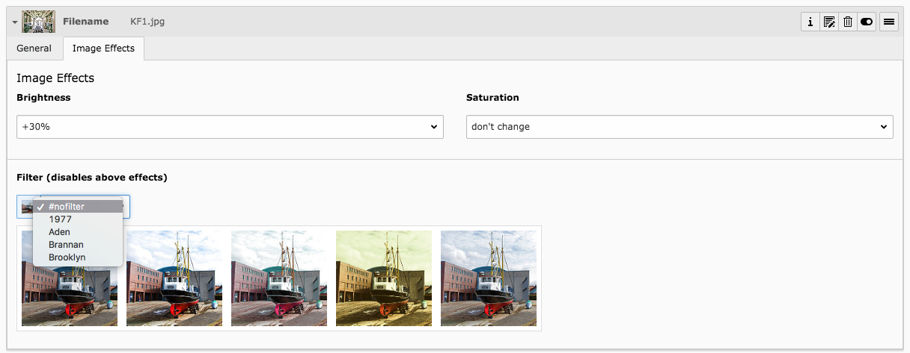

# TYPO3 Extension: Image effects
 
Apply effects and filters to your images in TYPO3!

## What it does:



Provides new fields for image file references that let you select effects or filters for your image.

## Configuration

The new fields are **not** added to `sys_file_reference` globally, but you have to enable/configure this per field.
A TCA image field definition could look like this:

````php
$GLOBALS['TCA']['tx_myext_mytable']['columns']['images'] = [
   'label' => 'Images',
   'config' => \TYPO3\CMS\Core\Utility\ExtensionManagementUtility::getFileFieldTCAConfig(
       'images',
       [
           'maxitems' => 99,
           'foreign_types' => [
               \TYPO3\CMS\Core\Resource\File::FILETYPE_IMAGE => [
                   'showitem' => '
            --palette--;LLL:EXT:lang/locallang_tca.xlf:sys_file_reference.imageoverlayPalette;imageoverlayPalette,
            --palette--;;filePalette,
            --div--;Image Effects,
            --palette--;LLL:EXT:image_effects/Resources/Private/Language/locallang_db.xlf:sys_file_reference.imageEffectsPalette;imageEffectsPalette,
            tx_imageeffects_filter
                '
               ],
           ],
       ],
       $GLOBALS['TYPO3_CONF_VARS']['GFX']['imagefile_ext']
   ),
]
````

Notice the `imageEffectsPalette` palette and the `tx_imageeffects_filter` field which are provided by this extension.

## Usage

To output the file reference in fluid you need to use the custom `ImageViewHelper` provided by this extension:

````xml
<html data-namespace-typo3-fluid="true" xmlns:f="http://typo3.org/ns/TYPO3/Fluid/ViewHelpers" xmlns:ifx="http://typo3.org/ns/Smichaelsen/ImageEffects/ViewHelpers">
<ifx:image src="{myFileReference.uid}" treatIdAsReference="1" height="540" />
</html>
````

You can use any arguments just like you would with `<f:image>`, just notice:

* Pass the uid of the sys_file_reference as `src`
* Set `treatIdAsReference` to `1`

## Attributions

<br>
Sample image shown in the filter selector in the backend was published on [flickr](https://www.flickr.com/photos/a-issleib/9348841209/) by Andreas Issleib under
[CC-BY-NC 2.0 License](https://creativecommons.org/licenses/by-nc/2.0/), thank you!

The filters are inspired from [CSSgram](https://una.im/CSSgram/).
